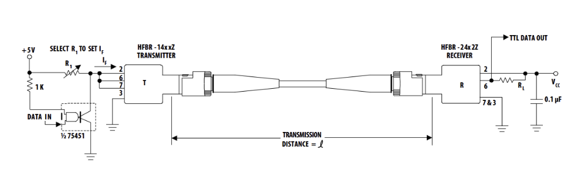
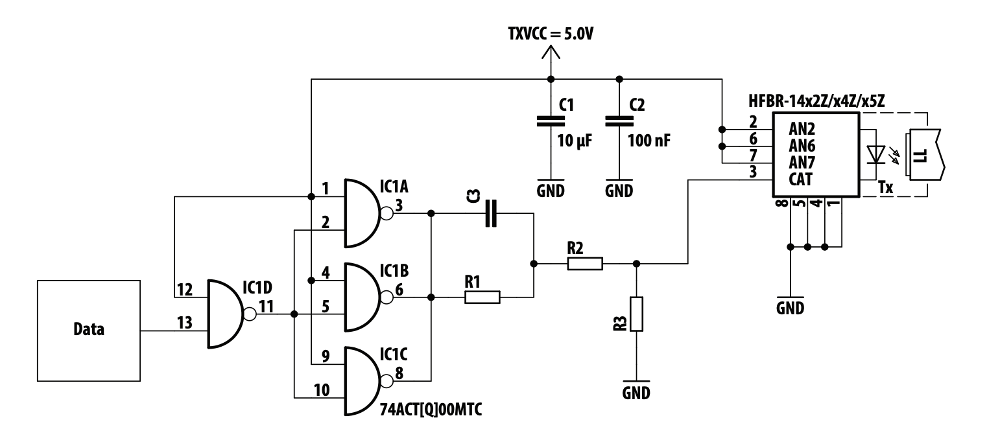
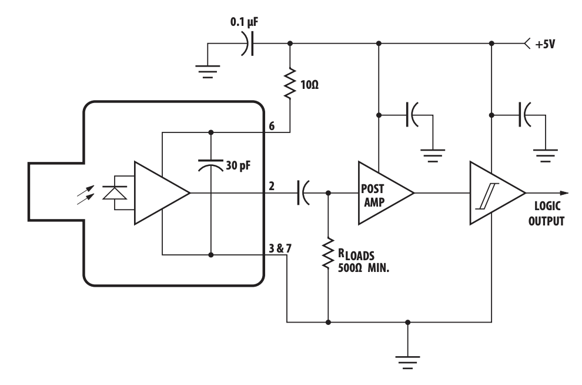

# Fiber Optic Communication System
Arduino fiber‑optic transceiver demo with Python GUI for real‑time communication

## 🔧 Hardware Overview

### 🧰 Components Used
- Arduino Uno R3 (Receiver)
- Arduino Uno R4 (Transmitter)
- HFBR‑1414Z LED Transmitter
- HFBR‑2412Z & HFBR‑2416Z Photodiode Receivers
- Multimode ST Fiber (1 m, 750 m, 1.5 km)
- 7404 TTL Inverter
- LCD Display
- Basic passive components (resistors, capacitors)

---

### 🖼 Schematics

#### 🔁 Full Transceiver Schematic

#### 📤 Transmitter Circuit

#### 📥 Receiver Circuit

